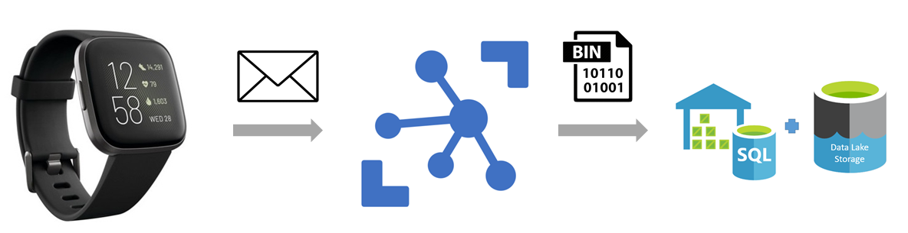

# Human Activity Recognition through Smart Watch sensors

Human activity recognition is the problem of classifying sequences of sensor data (typically: accelerometer, gyroscope, heart rate) recorded by specialized harnesses or smart devices into known well-defined movements.

The information retrieved from inertial sensors embedded in everyday devices, such as smartphones or smart watches, can be used to classify a set of physical activities through a supervised Machine Learning algorithm.

It is a challenging problem given the large number of observations produced each second, the temporal nature of the observations, and the lack of a clear way to relate sensor data to known movements.

Classical approaches to the problem involve hand crafting features from the time series data based on fixed-size windows and training machine learning models, such as ensembles of decision trees.

Recently, deep learning methods such as recurrent neural networks and convolutional neural networks (CNNs) have been shown to provide state-of-the-art results on challenging activity recognition tasks with little or no data feature engineering.

## Dataset and Pre-processing

There was a data collection experiment carried out with a group of 5 users. For this initial experiment all participants were wearing a Fitbit smart watch while performing the activities.

Ten acitivities ('Walking','Upstairs','Downstairs','Running','Standing','Sitting','Jumping','Squad','Laying','Situp') were executed by every single participant with a sample collection frequency rate of 10Hz (~10 samples per second). Triaxial acelerometer and gyroscope measurements were captured from the smart watch.

These data signals are sampled at 10Hz and segmented by taking a sliding window frames of 1 second each. The data was labeled, and randomly partitioned into two sub-sets, 70% for the training data and 30% the test data.

Azure IoT Hub solution was used to enable highly secure and reliable communication between an IoT application and the smart devices. The incoming messages were managed and routes to a Storage account via the IoT Hub connection.

## Approach

This project conducts a brief exploratory data analysis to better understand the raw data and its limitations. Starting with a principal component analysis, followed by spliting the dataset into 'window frames' to visualy categorize different activities and finaly building a convolutional neural network.

Furthermore, after building a convolutional neural network. This project explore Azure Machine Learning services to run experiments, register a model and deploy it into an Azure Container Instance (ACI) as the staging environment and finally deploy it into an Azure Kubernetes Service (AKS) as the production environment.

## Convolutional Neural Networks

A convolutional neural network consists of an input and an output layer, as well as multiple hidden layers. The hidden layers of a CNN typically consist of a series of convolutional layers that convolve with a multiplication or other dot product. The activation function is commonly a RELU layer, and is subsequently followed by additional convolutions such as pooling layers, fully connected layers and normalization layers, referred to as hidden layers because their inputs and outputs are masked by the activation function and final convolution.

Though the layers are colloquially referred to as convolutions, this is only by convention. Mathematically, it is technically a sliding dot product or cross-correlation. This has significance for the indices in the matrix, in that it affects how weight is determined at a specific index point.

## Azure Machine Learning
In this Jupyter Notebook I will explore various cloud services, e.g. [Azure ML Services](https://azure.microsoft.com/en-us/services/machine-learning-service/) and [Azure Blob Storage](https://docs.microsoft.com/en-us/azure/storage/blobs/storage-blobs-introduction).

## Other relevant information

## What is MLOps?
**MLOps** (a compound of "[machine learning](https://en.wikipedia.org/wiki/Machine_learning)" and "operations") is a practice for collaboration and communication between [data scientists](https://en.wikipedia.org/wiki/Data_scientists) and operations professionals to help manage production ML lifecycle.
Similar to the [DevOps](https://en.wikipedia.org/wiki/DevOps) or [DataOps](https://en.wikipedia.org/wiki/DataOps) approaches, MLOps looks to increase automation and improve the quality of production ML while also focusing on business and regulatory requirements.

## How does Azure ML help with MLOps?
Azure ML contains a number of asset management and orchestration services to help you manage the lifecycle of your model training & deployment workflows.

With Azure ML + Azure DevOps you can effectively and cohesively manage your datasets, experiments, models, and ML-infused applications.
