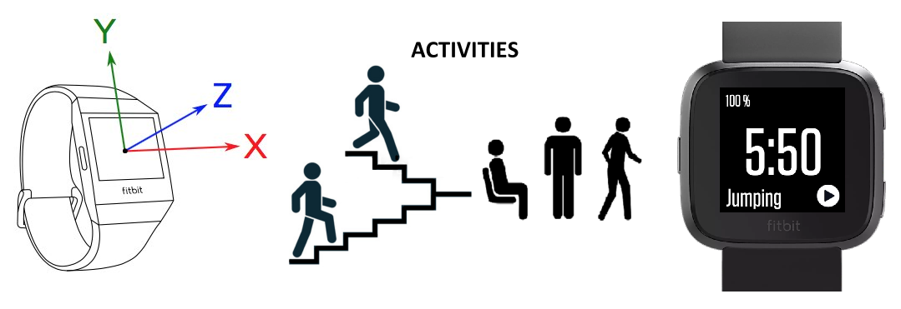
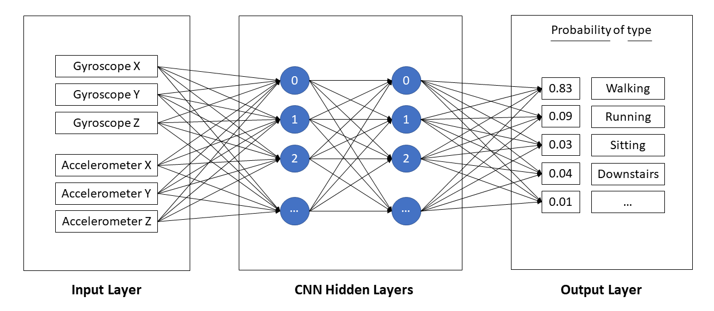

# Human Activity Recognition through Smart Watch sensors

Human activity recognition is the problem of classifying sequences of sensor data (typically: accelerometer, gyroscope, heart rate) recorded by specialized harnesses or smart devices into known well-defined movements.

It is a challenging problem given the large number of observations produced each second, the temporal nature of the observations, and the lack of a clear way to relate sensor data to known movements.

Classical approaches to the problem involve hand crafting features from the time series data based on fixed-size windows and training machine learning models, such as ensembles of decision trees.

Recently, deep learning methods such as recurrent neural networks and convolutional neural networks (CNNs) have been shown to provide state-of-the-art results on challenging activity recognition tasks with little or no data feature engineering.

## Convolutional Neural Networks

A convolutional neural network consists of an input and an output layer, as well as multiple hidden layers. The hidden layers of a CNN typically consist of a series of convolutional layers that convolve with a multiplication or other dot product. The activation function is commonly a RELU layer, and is subsequently followed by additional convolutions such as pooling layers, fully connected layers and normalization layers, referred to as hidden layers because their inputs and outputs are masked by the activation function and final convolution.

Though the layers are colloquially referred to as convolutions, this is only by convention. Mathematically, it is technically a sliding dot product or cross-correlation. This has significance for the indices in the matrix, in that it affects how weight is determined at a specific index point.

## Approach

In this experiment we would focus on analysing human activity raw data from a Fitbit smart watch.

For this initial approach, the data was collected at a frequency of 10Hz (~10 samples per second) and includes triaxial acelerometer and gyroscope measurements for a single user.

Also, this experiment introduces exploratory data analysis to understand the data and its limitations. Starting with a principal component analysis, following by spliting or breaking down the data into 'window frames' and finaly building and training a convolutional neural network.

# MLOps on Azure
This repository contains code that is used for a [MLOps](https://en.wikipedia.org/wiki/MLOps) Workshop.

In this Jupyter Notebook I will explore various cloud services, e.g. [Azure ML Services](https://azure.microsoft.com/en-us/services/machine-learning-service/) and [Azure Blob Storage](https://docs.microsoft.com/en-us/azure/storage/blobs/storage-blobs-introduction).

## What is MLOps?
**MLOps** (a compound of "[machine learning](https://en.wikipedia.org/wiki/Machine_learning)" and "operations") is a practice for collaboration and communication between [data scientists](https://en.wikipedia.org/wiki/Data_scientists) and operations professionals to help manage production ML lifecycle.
Similar to the [DevOps](https://en.wikipedia.org/wiki/DevOps) or [DataOps](https://en.wikipedia.org/wiki/DataOps) approaches, MLOps looks to increase automation and improve the quality of production ML while also focusing on business and regulatory requirements.

## How does Azure ML help with MLOps?
Azure ML contains a number of asset management and orchestration services to help you manage the lifecycle of your model training & deployment workflows.

With Azure ML + Azure DevOps you can effectively and cohesively manage your datasets, experiments, models, and ML-infused applications.
